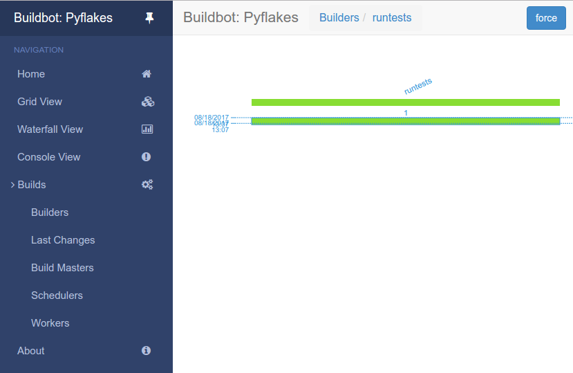

.. _quick-tour-label:

============
快速开始
============

目标
----

通过快速浏览示例配置注释中所提示的buildbot的某些功能，本教程将在 :ref:`首次运行`教程的基础上进行扩展。
我们将仅更改默认配置的一部分并解释激活的功能。

作为本教程的一部分，我们将使用buildbot进行一些实际上的构建

这个章节中，我们将教你

- 简单改变一些配置并激活他们
- 处理一些配置上的错误
- 强行构建
- 使用并且控制IRC机器人
- 通过ssh debug
- 给调度器增加个 `try`

设置项目的名字和URL
----------------------------

让我们从简单的位置开始，看看您将在哪里自定义buildbot的项目名称和URL。

我们从:ref:`first-run-label`教程继续

打开一个终端，进入你刚才创建的master目录，激活虚拟环境，然后打开master的配置进行编辑

.. code-block:: bash

  cd ~/tmp/bb-master
  source sandbox/bin/activate
  $EDITOR master/master.cfg

现在，查找被标记为 *PROJECT IDENTITY* 部分写了什么::

  ####### PROJECT IDENTITY

  # 'title'字符串将出现在buildbot安装目录的顶部.

  c['title'] = "Hello World CI"
  c['titleURL'] = "https://buildbot.github.io/hello-world/"

你可以随意更改这些链接，如果你想看一下你改动了之后会发生什么

更改之后，进入终端，然后输入

.. code-block:: bash

  buildbot reconfig master

你会在master日志中看到几行比较少的输出，像下面这样

.. code-block:: none

    2011-12-04 10:11:09-0600 [-] loading configuration from /path/to/buildbot/master.cfg
    2011-12-04 10:11:09-0600 [-] configuration update started
    2011-12-04 10:11:09-0600 [-] builder runtests is unchanged
    2011-12-04 10:11:09-0600 [-] removing IStatusReceiver <...>
    2011-12-04 10:11:09-0600 [-] (TCP Port 8010 Closed)
    2011-12-04 10:11:09-0600 [-] Stopping factory <...>
    2011-12-04 10:11:09-0600 [-] adding IStatusReceiver <...>
    2011-12-04 10:11:09-0600 [-] RotateLogSite starting on 8010
    2011-12-04 10:11:09-0600 [-] Starting factory <...>
    2011-12-04 10:11:09-0600 [-] Setting up http.log rotating 10 files of 10000000 bytes each
    2011-12-04 10:11:09-0600 [-] WebStatus using (/path/to/buildbot/public_html)
    2011-12-04 10:11:09-0600 [-] removing 0 old schedulers, updating 0, and adding 0
    2011-12-04 10:11:09-0600 [-] adding 1 new changesources, removing 1
    2011-12-04 10:11:09-0600 [-] gitpoller: using workdir '/path/to/buildbot/gitpoller-workdir'
    2011-12-04 10:11:09-0600 [-] GitPoller repository already exists
    2011-12-04 10:11:09-0600 [-] configuration update complete

    Reconfiguration appears to have completed successfully.

重要的几行是告诉您它正在顶部加载新配置，而底部的行则表明更新已完成。

现在如果你回到 `the waterfall page <http://localhost:8010/#/waterfall>`_ 您会看到该项目的名称就是您可能要更改的名称，当您单击页面底部的项目名称的URL时，它应该带您进入配置中的链接。

配置错误
-------

配置buildbot出错是很常见的，所以你可以看下这个案例中发生了什么以及你该怎么处理错误

再次打开配置，并通过删除更改的两行中的第一个单引号来引入语法错误，因此它们显示为：，

..
    Format a `none` since this is not a valid Python code

.. code-block:: none

  c[title'] = "Hello World CI"
  c[titleURL'] = "https://buildbot.github.io/hello-world/"

This creates a Python ``SyntaxError``.

现在回去更新buildmaster的配置

.. code-block:: bash

  buildbot reconfig master

这次，输出是这个样子的:

.. code-block:: none

    2015-08-14 18:40:46+0000 [-] beginning configuration update
    2015-08-14 18:40:46+0000 [-] Loading configuration from '/data/buildbot/master/master.cfg'
    2015-08-14 18:40:46+0000 [-] error while parsing config file:
	    Traceback (most recent call last):
	      File "/usr/local/lib/python2.7/dist-packages/buildbot/master.py", line 265, in reconfig
		d = self.doReconfig()
	      File "/usr/local/lib/python2.7/dist-packages/twisted/internet/defer.py", line 1274, in unwindGenerator
		return _inlineCallbacks(None, gen, Deferred())
	      File "/usr/local/lib/python2.7/dist-packages/twisted/internet/defer.py", line 1128, in _inlineCallbacks
		result = g.send(result)
	      File "/usr/local/lib/python2.7/dist-packages/buildbot/master.py", line 289, in doReconfig
		self.configFileName)
	    --- <exception caught here> ---
	      File "/usr/local/lib/python2.7/dist-packages/buildbot/config.py", line 156, in loadConfig
		exec f in localDict
	    exceptions.SyntaxError: EOL while scanning string literal (master.cfg, line 103)

    2015-08-14 18:40:46+0000 [-] error while parsing config file: EOL while scanning string literal (master.cfg, line 103) (traceback in logfile)
    2015-08-14 18:40:46+0000 [-] reconfig aborted without making any changes

    Reconfiguration failed. Please inspect the master.cfg file for errors,
    correct them, then try 'buildbot reconfig' again.

这次，明确的说有一个错误在配置中。幸运的是，buildbot master 会忽略这个配置错误，并且会继续使用以前的配置运行

这个消息够清楚了，所以，重新打开配置，处理这个错误，然后更新master的配置

你的第一次构建
----------------

By now you're probably thinking: "All this time spent and still not done a single build? What was the name of this project again?"
现在你可能会想，花了这么多时间还没执行完一次构建，这个项目叫什么？

在 `Builders <http://localhost:8010/#/builders>`_ 页面, 点击runtests连接

You'll see a builder page, and a blue "force" button that will bring up the
following dialog box:
你将看到一个builder page 页面，有一个蓝色 "force" 按钮， 淡季后将会弹出下面的对话框

.. image:: _images/force-build.png
   :alt: force a build.

点击 *Start Build* - 这次不需要填写任何东西
下一步，点击 `view in waterfall <http://localhost:8010/#/waterfall?show=runtests>`_.

你会看到:

激活IRC机器人
--------------------

buildbot 包括一个IRC机器人，你可以加入一个频道，然后了解buildbot的运行状态

.. note:: 安全须知

请注意，任何有权访问您的irc频道或可以将私人消息发送给该漫游器的用户都可以创建或停止build :bug:`3377`.

第一步，启动一个IRC客户端，连接irc.freenode.net  然后加入一个空的频道
在这个样例中，我们使用 ``#buildbot-test`` ,所以，加入这个频道（注意，请不要加入buildbot主频道

编辑 :file:`master.cfg` 然后找到 *BUILDBOT SERVICES* 部分.
在这一章节的最后添加一行::

  c['services'].append(reporters.IRC(host="irc.freenode.net", nick="bbtest",
                                     channels=["#buildbot-test"]))

重新配置build master的配置然后做如下操作:

.. code-block:: bash

  grep -i irc master/twistd.log

输出的日志应该包含下面这一行:

.. code-block:: none

  2016-11-13 15:53:06+0100 [-] Starting factory <...>
  2016-11-13 15:53:19+0100 [IrcStatusBot,client] <...>: I have joined #buildbot-test

加入IRC频道看一下bot输出了什么.
在你的IRC频道中输入:

.. code-block:: none

  bbtest: commands

获取bot能支持的命令列表.

让我们告诉漫游器通知某些事件，以了解我们可以通知哪些事件:

.. code-block:: none

  bbtest: help notify

现在让我们看一些事件通知:

.. code-block:: irc

  <@lsblakk> bbtest: notify on started finished failure
  < bbtest> The following events are being notified: ['started', 'failure', 'finished']

现在，返回Web界面并强制进行另一个构建。
或者，要求机器人强制构建：

.. code-block:: irc

  <@lsblakk> bbtest: force build --codebase= runtests
  < bbtest> build #1 of runtests started
  < bbtest> Hey! build runtests #1 is complete: Success [finished]

你可以在web界面上看到一个新的构建

.. image:: _images/irc-testrun.png
   :alt: a successful test run from IRC happened.

完整的文档可从以这里查看： :bb:reporter:`IRC`.

设置web用户权限
-------------

默认配置允许所有人通过web界面执行任何任务，像创建或者停止构建，要限制用户，查找这一行::

  c['www'] = dict(port=8010,
                   plugins=dict(waterfall_view={}, console_view={}))

and append::

  c['www']['authz'] = util.Authz(
          allowRules = [
              util.AnyEndpointMatcher(role="admins")
          ],
          roleMatchers = [
              util.RolesFromUsername(roles=['admins'], usernames=['Alice'])
          ]
  )
  c['www']['auth'] = util.UserPasswordAuth([('Alice','Password1')])

想了解更多细节，查看 :ref:`Web-Authentication`.

使用Manhole调试
--------------

你可是使用manhole进行调试，一个交互的python终端，它开放了所有的buildmaster账户权限，包括删除文件的能力，因此不应使用弱密码或容易猜到的密码来启用它。

你需要安装一到两个包在虚拟环境中，才能使用它

.. code-block:: bash

  cd ~/tmp/bb-master
  source sandbox/bin/activate
  pip install -U pip
  pip install cryptography pyasn1

你也需要为Manhole server 生成一个SSH key

.. code-block:: bash

  mkdir -p /data/ssh_host_keys
  ckeygen -t rsa -f /data/ssh_host_keys/ssh_host_rsa_key

在你的 master.cfg 寻找::

  c = BuildmasterConfig = {}

插入下面的代码给manhole打开调试模式::

  ####### DEBUGGING
  from buildbot import manhole
  c['manhole'] = manhole.PasswordManhole("tcp:1234:interface=127.0.0.1",
                                         "admin", "passwd",
                                         ssh_hostkey_dir="/data/ssh_host_keys/")

重启master后， 你可以通过ssh登录到master，进入python交互环境

.. code-block:: bash

  ssh -p1234 admin@127.0.0.1
  # enter passwd at prompt

.. note::
    The pyasn1-0.1.1 release has a bug which results in an exception similar to
    this on startup:

    .. code-block:: none

        exceptions.TypeError: argument 2 must be long, not int

    If you see this, the temporary solution is to install the previous version
    of pyasn1:

    .. code-block:: bash

        pip install pyasn1-0.0.13b

如果你想检查哪个worker连接进来了，哪个worker承担了构建者的角色，你可以这么做::

  >>> master.workers.workers
  {'example-worker': <Worker 'example-worker', current builders: runtests>}

可以使用`dir(x)`或辅助函数`show(x)`来更深入地探索对象。

增加 try scheduler
------------------

Buildbot提供了一种开发人员提交补丁进行测试而无需将其提交到源代码控制系统的方法。
（这对于支持多个操作系统或体系结构的项目确实非常方便。）

将下面的代码添加到 master.cfg 完成设置

  from buildbot.scheduler import Try_Userpass
  c['schedulers'] = []
  c['schedulers'].append(Try_Userpass(
                                      name='try',
                                      builderNames=['runtests'],
                                      port=5555,
                                      userpass=[('sampleuser','samplepass')]))

然后你可以这样提交变动 :bb:cmdline:`try` command.

让我们通过对hello-world进行单行更改来进行尝试，例如，使其默认情况下跟踪树:

.. code-block:: bash

  git clone https://github.com/buildbot/hello-world.git hello-world-git
  cd hello-world-git/hello
  $EDITOR __init__.py
  # change 'return "hello " + who' on line 6 to 'return "greets " + who'

然后，执行buildbot 中的 ``try`` 命令，像下面这样

.. code-block:: bash

    cd ~/tmp/bb-master
    source sandbox/bin/activate
    buildbot try --connect=pb --master=127.0.0.1:5555 \
        --username=sampleuser --passwd=samplepass --vc=git

这将为你执行 ``git diff`` 并将生成的补丁发送到服务器以针对Git的最新资源进行构建和测试。

现在回到 `waterfall <http://localhost:8010/#/waterfall>`_页面，点击 runtests 连接， 然后向下翻，
您应该看到所做的更改已经开始了另一个构建（因此，测试的stdout应该作为结果输出到屏幕）。
该工作的“原因”将被列为“try' job”，而责任者将为空

To make yourself show up as the author of the change, use the ``--who=emailaddr`` option on ``buildbot try`` to pass your email address.

To make a description of the change show up, use the ``--properties=comment="this is a comment"`` option on ``buildbot try``.

To use ssh instead of a private username/password database, see :bb:sched:`Try_Jobdir`.
